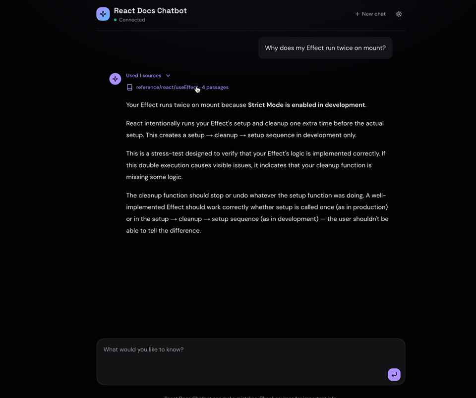

<div align="center">


# React Docs Chatbot

<p>
  
  
</p>

**Ask anything about React and get answers grounded in the official docs, with citations.**

A **GenAI** chat app built on a **RAG** pipeline over the [react.dev](https://react.dev) documentation. Answers stream in token by token, and every claim traces back to the page it came from.

<p>
  
  
  
  
  
  
</p>

<br />

<a href="docs/demo.mp4">
  
</a>

<p><em>▶️ <a href="docs/demo.mp4"><b>Watch the demo</b></a>: streaming answers with expandable source citations</em></p>

</div>

---

## ✨ What makes it work

🎯 &nbsp;**Grounded answers.** The model only ever sees the retrieved extracts. When those don't cover the question it replies `I don't know based on the documents.` rather than filling the gap.

🔗 &nbsp;**Citations come from metadata.** The `sources` event is built from the retrieval hits and sent before the first token, and the prompt tells the model not to cite in prose. Attribution can't drift from what was actually retrieved.

🧩 &nbsp;**Headings go inside the embedding.** Every chunk carries `Title > Section > Subsection` in its own text, since embeddings never see vector-store metadata.

🧼 &nbsp;**The MDX cleaner is fence-aware.** react.dev isn't plain markdown. Cleaning strips the doc-site chrome and leaves the 297 JSX examples inside code fences alone.

⚡ &nbsp;**Streaming the whole way through.** SSE from OpenRouter, through FastAPI, into a typed parser written by hand in the browser.

---

## 🚀 Quick start

> **Prerequisites:** Python 3.13 with [uv](https://docs.astral.sh/uv/), Node.js 20+, and an [OpenRouter](https://openrouter.ai) API key.

```sh
echo "OPENROUTER_API_KEY=sk-or-..." > api/.env
make setup     # fetch the docs, then embed them  (~1.5¢ in embedding calls)
make dev       # API on :8000, web on :3000
```

Open **http://localhost:3000** and ask something.

> [!NOTE]
> `make setup` costs money because it calls an embeddings API. Re-run it only when the corpus changes, or when `clean.py` / `chunker.py` change how text is prepared.

### Commands

| Command | What it does |
| :--- | :--- |
| `make dev` | Runs the API (uvicorn, reload) and the web dev server together |
| `make fetch` | Re-downloads react.dev's docs into `api/corpus/` |
| `make ingest` | Cleans, chunks and embeds `api/corpus/` into `api/chroma/` |
| `make setup` | `fetch` + `ingest`, for a fresh clone |
| `make test` | `pytest` + `ruff check` in `api/` |

> [!TIP]
> Ingestion is idempotent: chunk ids are `<corpus-relative-path>:<index>`, written with `upsert`. Shrinking a source file does leave its orphaned tail chunks behind, so delete `api/chroma/` when you want a guaranteed-clean rebuild.

---

## 🏗️ How it works

```
  INGEST ─────────────────────────────────────────────────────────────

  scripts/fetch-corpus.sh   react.dev/src/content  ──▶  api/corpus/*.md
            │
  rag/clean.py              MDX ──▶ plain markdown
            │               frontmatter titles · chrome components
            │               heading anchors · relative links
            │
  rag/chunker.py            split on headings, then ~400 chars
            │               heading prepended into the chunk text
            │
  rag/embeddings.py         openai/text-embedding-3-small
            │
  rag/store.py              upsert ──▶ Chroma "docs" (cosine) @ api/chroma/


  QUERY ──────────────────────────────────────────────────────────────

  POST /chat/stream         rag.store.search        ──▶ top-k chunks
            │               rag.answer.build_prompt ──▶ <context> block
            │               claude-haiku-4.5, streamed
            ▼
  SSE                       sources ──▶ token* ──▶ done │ error
            │
  web/lib/chat-stream.ts    typed parser ──▶ use-chat.ts ──▶ app/page.tsx
```

<details>
<summary><b>📁 Project structure</b></summary>

<br />

```
api/                 FastAPI service + ingestion pipeline (Python 3.13, uv)
  rag/
    main.py            API: /health and the /chat/stream SSE endpoint
    answer.py          system prompt + <context> prompt builder
    ingest.py          CLI entrypoint: walk a folder, ingest every .md
    store.py           Chroma collection, ingest() and search()
    chunker.py         header-aware + recursive splitting
    clean.py           react.dev MDX -> plain markdown
    embeddings.py      OpenRouter embeddings client
  scripts/
    fetch-corpus.sh    downloads react.dev's src/content
  corpus/            fetched markdown (gitignored, ~210 files)
  chroma/            persisted vector store (gitignored)
  tests/             pytest, covering cleaning and chunking behaviour

web/                 Next.js 16 + React 19 + Tailwind v4 chat UI
  app/page.tsx         the chat page
  lib/chat-stream.ts   SSE parser, typed events
  lib/use-chat.ts      streaming chat state (send / retry / stop / reset)
  lib/react-dev-url.ts corpus path -> react.dev URL
  components/          shadcn/ui primitives + ai-elements chat components

docs/                demo recording + poster frame
Makefile             dev / fetch / ingest / setup / test
```

</details>

---

## 🔌 API

Base URL `http://localhost:8000`. CORS is open to `http://localhost:3000` only.

### `GET /health`

```json
{ "ok": true, "chunks": 10444 }
```

### `POST /chat/stream`

```jsonc
{ "question": "How do I reset state when a prop changes?", "k": 4 }
```

Responds with `text/event-stream`:

| Event | Data | When |
| :--- | :--- | :--- |
| `sources` | Array of hits: `text`, `source`, `position`, `distance` | Once, before any token |
| `token` | One delta of the answer | Repeatedly |
| `error` | A safe message; the real error is logged server-side | On stream failure |
| `done` | `[DONE]` | Always last |

```sh
curl -N http://localhost:8000/chat/stream \
  -H 'Content-Type: application/json' \
  -d '{"question": "What is a key in a list?", "k": 4}'
```

> [!IMPORTANT]
> The catch-all around the LLM stream in `rag/main.py` is deliberate. This is the stream boundary, and anything that escapes it truncates the SSE response with no error event, so the client just sees the stream stop.

---

## ⚙️ Configuration

| Variable | Where | Purpose |
| :--- | :--- | :--- |
| `OPENROUTER_API_KEY` | `api/.env` *(gitignored)* | **Required.** Used for embeddings and for chat completions |
| `NEXT_PUBLIC_API_BASE_URL` | `web/.env.local` | API origin; defaults to `http://localhost:8000` |

Models and retrieval knobs live in code:

| Setting | Value | Where |
| :--- | :--- | :--- |
| Embedding model | `openai/text-embedding-3-small` | `rag/embeddings.py` |
| Chat model | `anthropic/claude-haiku-4.5` | `rag/main.py` |
| Max output tokens | `800` | `rag/main.py` |
| Chunk size / overlap | `400` / `50` chars | `rag/store.ingest` |
| Default `k` | `4` (API), `3` (`search()`) | `rag/main.py`, `rag/store.py` |
| Distance metric | cosine | `rag/store.get_collection` |

---

## 🔬 The hard part: cleaning react.dev

react.dev is MDX, not markdown. Ingesting it naively degrades retrieval in ways that are easy to miss, which is what most of `rag/clean.py` exists to prevent.

<details open>
<summary><b>Titles live in frontmatter, not <code>#</code> headings</b></summary>

Only 2 of 222 files have an h1. Unless the frontmatter title is promoted into one, the splitter's `title` slot comes back empty and chunks lose the single word most queries are about. DOM component pages key on the tag name (`meta: "<meta>"`) instead of `title`, so there's a first-key fallback.

</details>

<details>
<summary><b>Doc-site components are stripped, code is not</b></summary>

297 distinct capitalised tags appear *inside* code fences as React examples. Only a closed list of chrome components (`<Note>`, `<Pitfall>`, `<Sandpack>`, …) gets removed, and only outside fences. The tag is dropped but the body it wraps stays, because that body is usually the caveat people are asking about.

</details>

<details>
<summary><b>Relative links are stripped</b></summary>

`[useState](/reference/react/useState)` resolves against react.dev, not against this app. The label is kept and the target dropped. Attribution comes from the sources panel instead, which is built from stored metadata rather than generated text.

</details>

<details>
<summary><b>Hidden and presentational fences are dropped</b></summary>

Sandpack scaffolding files and Sandpack CSS are hidden from react.dev's own readers, so they stay out of the index too. Fence matching is length-aware, since the four-backtick fence in the React 19 blog post desyncs a naive three-backtick matcher.

</details>

Two smaller choices in the same area:

- `fetch-corpus.sh` drops `community/` and `errors/` before anything is indexed. One is team bios and meetup listings, the other is three copies of the same boilerplate, and neither is reference material.
- Chunk ids use the corpus-relative path rather than the basename, because react.dev has nine `index.md` files plus five other duplicated basenames. On bare filenames they would collide and silently overwrite each other.

---

## 🧪 Tests

```sh
make test          # or: cd api && uv run pytest
```

`api/tests/test_clean.py` covers the cleaning rules above: frontmatter titles, anchor stripping, chrome removal, and the fence handling that keeps JSX examples intact.

---

<div align="center">
<sub>Docs sourced from <a href="https://github.com/reactjs/react.dev">reactjs/react.dev</a> · Answers can be wrong, so check the cited sources.</sub>
</div>
